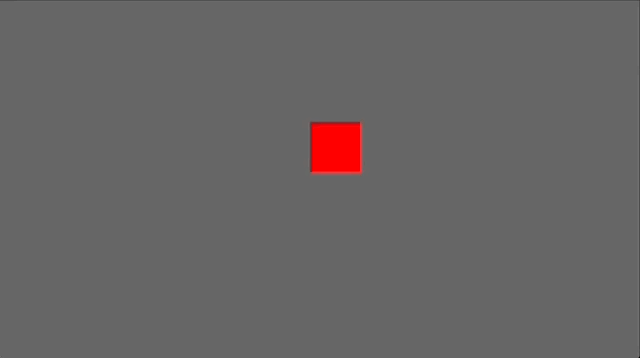

# Examples

### [sprite_color.rs](./sprite_color.rs)

```rust
materials.add(Color::RED.into()).ease_to(
    materials.add(Color::BLUE.into()),
    *ease_function,
    bevy_easings::EasingType::PingPong {
        duration: std::time::Duration::from_secs(1),
        pause: std::time::Duration::from_millis(500),
    },
)
```


### [sprite_size.rs](./sprite_size.rs)

```rust
Sprite {
    size: Vec2::new(initial_size, initial_size),
    ..Default::default()
}
.ease_to(
    Sprite {
        size: Vec2::new(final_size, final_size),
        ..Default::default()
    },
    *ease_function,
    bevy_easings::EasingType::PingPong {
        duration: std::time::Duration::from_secs(1),
        pause: std::time::Duration::from_millis(500),
    },
)
```


### [transform_rotation.rs](./transform_rotation.rs)

```rust
Transform::default().ease_to(
    Transform::default().with_rotation(Quat::from_rotation_ypr(0., 0., 3.1415 / 2.)),
    *ease_function,
    bevy_easings::EasingType::PingPong {
        duration: std::time::Duration::from_secs(1),
        pause: std::time::Duration::from_millis(500),
    },
)
```


### [transform_translation.rs](./transform_translation.rs)

```rust
Transform::default()
    .with_translate(Vec3::new(x, screen_y, 0.))
    .ease_to(
        Transform::default().with_translate(Vec3::new(x, -screen_y, 0.)),
        *ease_function,
        bevy_easings::EasingType::PingPong {
            duration: std::time::Duration::from_secs(1),
            pause: std::time::Duration::from_millis(500),
        },
    ),
```


### [custom_component.rs](./custom_component.rs)

```rust
#[derive(Default)]
struct CustomComponent(f32);
impl bevy_easings::Lerp for CustomComponent {
    type Scalar = f32;

    fn lerp(&self, other: &Self, scalar: &Self::Scalar) -> Self {
        CustomComponent(self.0.lerp(&other.0, scalar))
    }
}
```

```rust
fn main() -> Result<(), Box<dyn std::error::Error>> {
    App::default()
        .add_default_plugins()
        .add_plugin(bevy_easings::EasingsPlugin)
        .add_startup_system(setup)
        .add_system(check_value)
        .add_system(bevy_easings::custom_ease_system::<CustomComponent>)
        .run();

    Ok(())
}
```

```rust
    commands
        .spawn_bundle(ImageBundle {
            ..Default::default()
        })
        // as `CustomComponent` is not already part of the components of the entity, 
        // insert the component with a basic value, it will be replaced immediately
        .insert(CustomComponent(-1.))
        .insert(CustomComponent(0.).ease_to(
            CustomComponent(100.),
            bevy_easings::EaseFunction::QuadraticInOut,
            bevy_easings::EasingType::PingPong {
                duration: std::time::Duration::from_secs(1),
                pause: std::time::Duration::from_millis(500),
            },
        ))
```

### [chain.rs](./chain.rs)

```rust
transform0
    .ease_to(
        transform1,
        bevy_easings::EaseFunction::QuadraticInOut,
        bevy_easings::EasingType::Once { duration },
    )
    .ease_to(
        transform2,
        bevy_easings::EaseFunction::QuadraticInOut,
        bevy_easings::EasingType::Once { duration },
    )
```


### [pause.rs](./pause.rs)

```rust
fn pause(timer: &Timer, mut easing: Mut<bevy_easings::EasingComponent<Transform>>) {
    if timer.tick(time.delta()).just_finished() {
        easing.state = !easing.state;
    }
}
```


### [react_on_end](./react_on_end.rs)

```rust
fn once_easing_done(
    removed: RemovedComponents<EasingComponent<Transform>>,
) {
    for entity in removed.iter() {
        /// you can do what you want with the entity that finished its easing
    }
}
```


